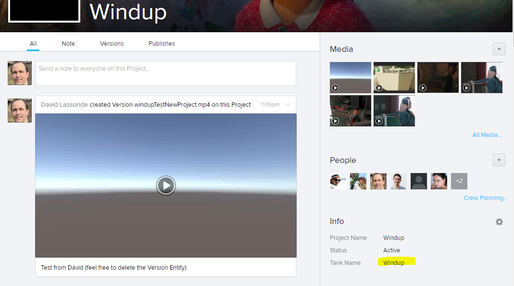
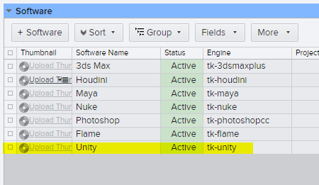
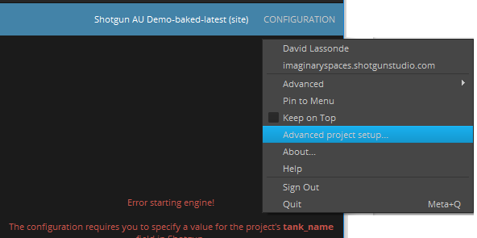

# Enabling Toolkit and Unity for your Shotgun Project

Shotgun projects need to be configured to use toolkit applications. 
1. Your Shotgun user must have the “Admin” Permission Group (Accessible under “Your Project”/People)
2. Click on “your avatar”/Site Preferences
    * Under File Management, Tick “Enable linking to local files”
    * Make sure (add) a Local File Storage named “primary” and set the platform paths. Make sure to pick a path that everyone in the studio can access. This is where the production data will be published. For example lots of studios use a network mapped drive on Windows (e.g. s:\\). This is a site preference and will be applied to all your Shotgun projects it is not advised to use a project name in this path.
3. Set the tank_name property for your project:
    * In your project overview page, there is a gear on the right side (Info). Use it to add the “Tank Name” property and set it to the name of the project (this string will be used to create folders in the folder defined at step 2 above so it might be better not to use spaces in the chosen string)
    
4. Enable Unity as a recognized engine:
    * Click on “your avatar”/Software
    * Add an entry (+Software button)
        * Software Name = Unity
        * Engine = tk-unity
    
5. Install toolkit for your project
    * From Shotgun Desktop, enter your project, then right-click and select Advanced project setup...
    
    Follow the steps

**Note:** if your new settings aren't taken into account, clear the Shotgun 
Desktop cache. To do so, exit Shotgun Desktop and remove the `%APPDATA%\Shotgun`
directory.

