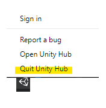
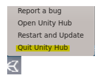
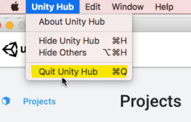

# Preparing a Unity project for Shotgun
Using the Package Manager window, add the Shotgun package which matches your
pipeline configuration in the table below:

| tk-config-unity version | com.unity.integrations.shotgun version |
| :---------------------- | :------------------------------------- |
| 1.2.9.1                 | 0.9.0                                  |
   
Shotgun should automatically initialize on Unity startup if you launched Unity 
from Shotgun. You should see a progress bar reporting the Shotgun toolkit 
bootstrap progress:

Once the progress bar disappears, you can use the Shotgun menu items. 

## Notes

### Always quit the Unity Hub between sessions
It is important to quit the Unity Hub between launches of Unity. Also,
certain environment variables can prevent the Shotgun integration to function 
properly. For more details, read the 
[troubleshooting](troubleshooting.md#problems-relating-to-the-unity-hub) 
section for more details.

**On Windows and CentOS, use the system tray icon:**

**On Mac, use the menu bar:**

### The Shotgun folder 
A Shotgun folder will be created under your Unity project's 
Assets folder. This Shotgun folder will automatically be deleted when Unity 
exits. Do not use the `Assets/Shotgun` folder to store your files, and do not 
modify its content.

### Disable Debug Logging
It is recommended to disable Debug Logging in order to get better performance 
(right-click in a 
gray area of Shotgun Desktop / Advanced / Toggle Debug Logging):

