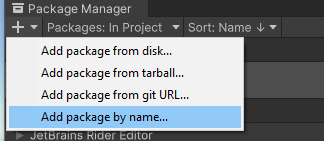
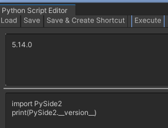

# Preparing a Unity project for ShotGrid

Before adding the ShotGrid package to a Unity project, the Python package must be installed.

## Install the Python package for Unity

Launch the Package Manager from the Unity Editor:

	Window > Package Manager > + > Add package by name:
	"com.unity.scripting.python"

(without the quotes)

	

Wait for the installation to finish.

## Install PySide2 Python package

The installation process involves the use of the `pip3` command line tool. Refer to the [Python for Unity](https://docs.unity3d.com/Packages/com.unity.scripting.python@4.0/manual/settings.html#pip-packages) documentation section on how to install a Pip package for a Unity Project.
PySide2 version 5.14 is required to use the ShotGrid package in Unity:

``` 	
> pip3 install PySide2==5.14
```

Once the package is installed, you can make sure it's available in your Project:

	Window > General > Python Console:
	
This will open a new window where we can execute some Python code. Copy paste the following in the lower section:

```
import PySide2
print(PySide2.__version__)
```

Press the "Execute" button. "5.14.0" should be printed in the console's output (upper section):



## Install the ShotgGrid package for Unity

Using the Package Manager window, add the ShotGrid package which matches your
pipeline configuration in the table below:

| tk-config-unity version | tk-unity version | com.unity.integrations.shotgrid version |
| :---------------------- | :--------------- | :------------------------------------- |
| 1.3.19.1                | 1.1              | 1.1.0
   
ShotGrid should automatically initialize on Unity startup if you launched Unity 
from ShotGrid. You should see a progress bar reporting the ShotGrid toolkit 
bootstrap progress:


Once the progress bar disappears, you can use the ShotGrid menu items.

## Notes

### Launching A Project
ShotGrid replaces the need to launch a project through the Unity hub.
Simply launch ShotGrid desktop and click on your Unity version. A file Selection
Directory should pop up. Navigate to your Unity project folder and select it. 
This should launch the project directly into your project Unity Editor. 

*Note*: Avoid spaces in the project name or the project path. For example, instead of naming the Project "ShotGrid Demo", 
name it "ShotGridDemo". Instead of placing the project in a directory "C:/Users/USERNAME/My Unity Projects Directory", 
use a directory path without any space: "C:/Users/USERNAME/MyUnityProjectsDirectory".
Otherwise, when launching Unity from ShotGrid Desktop, the Unity Hub will open and you will have to launch the Project from the Hub. 


### The ShotGrid folder 
A ShotGrid folder will be created under your Unity project's 
Assets folder. This ShotGrid folder will automatically be deleted when Unity 
exits. Do not use the `Assets/ShotGrid` folder to store your files, and do not 
modify its content.

### Disable Debug Logging
It is recommended to disable Debug Logging in order to get better performance 
(right-click in a 
gray area of ShotGrid Desktop / Advanced / Toggle Debug Logging):


