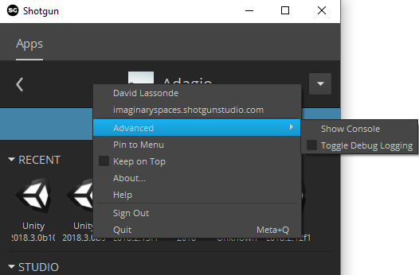

# Preparing a Unity project for Shotgrid
Using the Package Manager window, add the Shotgrid package which matches your
pipeline configuration in the table below:

| tk-config-unity version | tk-unity version | com.unity.integrations.shotgrid version |
| :---------------------- | :--------------- | :-------------------------------------- |
| 1.3.19.2                | 1.2              | 1.2.0                                   |
   
Shotgrid should automatically initialize on Unity startup if you launched Unity 
from Shotgrid. You should see a progress bar reporting the Shotgrid toolkit 
bootstrap progress:

Once the progress bar disappears, you can use the Shotgrid menu items. 

## Notes

### Launching A Project
Shotgrid replaces the need to launch a project through the Unity hub.
Simply launch Shotgrid desktop and click on your unity version. A file Selection
Directory should pop up. Navigate to your Unity project folder and select it. 
This should launch the project directly into your project Unity Editor. 

### The Shotgrid folder 
A Shotgrid folder will be created under your Unity project's 
Assets folder. This Shotgrid folder will automatically be deleted when Unity 
exits. Do not use the `Assets/Shotgrid` folder to store your files, and do not 
modify its content.

### Disable Debug Logging
It is recommended to disable Debug Logging in order to get better performance 
(right-click in a 
gray area of Shotgrid Desktop / Advanced / Toggle Debug Logging):

