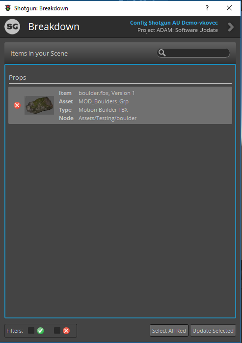
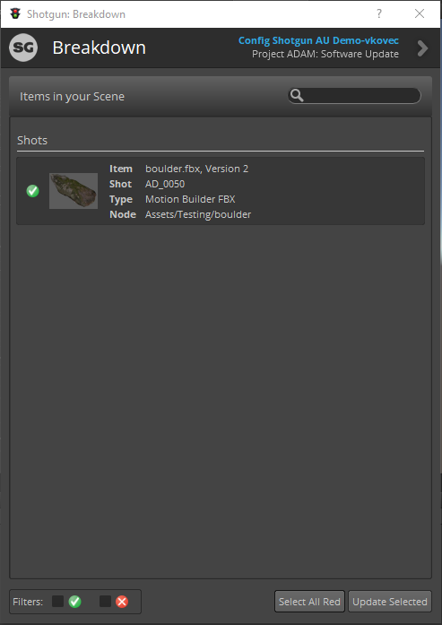

# Updating Assets with the Scene Breakdown Tool

The Scene Breakdown app gives a quick overview of all the assets that have been loaded into your Unity project from the Shotgrid Loader.
Assets shown with a small "x" to the left have newer versions available on Shotgrid. Assets with a green checkmark are up to date with the latest version in Shotgrid.

In order to update the outdated assets in the Unity project with the latest revision from Shotgrid, select the desired assets to update (optionally click the button on the bottom right of the window titled "Select All Red"
to update all the outdated assets at once.

Once all assets to update have been selected, click "Update Selected" in the bottom right corner of the window in order to update the assets in the project and in the current scene.

