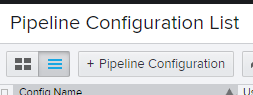
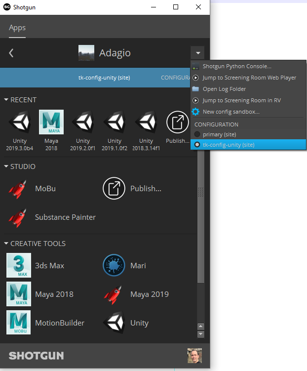

# ShotGrid Configuration
The easiest way to get started is to use the `tk-config-unity` pipeline 
configuration. It is constantly kept up-to-date with the `tk-config-default2` 
configuration. In fact, `tk-config-unity` is a version of `tk-config-default2` 
in which we added the tk-unity engine and some advanced workflows for working 
with ShotGrid inside of Unity.

If you are using a custom configuration, it should be straightforward to adapt
it to also use `tk-unity`. The recommended approach is to compare 
`tk-unity-config` with its matching `tk-config-default2` version. For example, 
you could compare `tk-config-unity` v1.2.9.1 with `tk-config-default2` 
v1.2.9.1 and add the required changes.

To use `tk-config-unity`, follow these steps: 

1. In the ShotGrid Web Client, go to “Your Avatar”/Default Layouts/Pipeline Configuration/Pipeline Configuration List
2. Create a new Pipeline Configuration 
     
     
    * Set the `Plugin Ids` field to `basic.*`
    * Set the `Descriptor` field to match the desired version of the config, 
    e.g. `sgtk:descriptor:github_release?organization=Unity-Technologies&repository=tk-config-unity&version=v1.2.9.1`
3. Launch ShotGrid Desktop 
4. Choose your project 
5. In the top section, if there is an arrow, click it and choose your new configuration 
     
6. Once loaded, you should see a Unity icon. Clicking on the arrow at the 
bottom-right of the Unity icon should display all the versions of Unity that 
were discovered by ShotGrid. If you do not see a Unity icon, go to 
[Enabling Toolkit and Unity for your ShotGrid Project](enablingToolkit.md) and 
resume these steps after
7. A file selection dialog should launch, navigate to your Unity project folder 
  and select it. This should launch the project directly without the need for the Unity Hub
