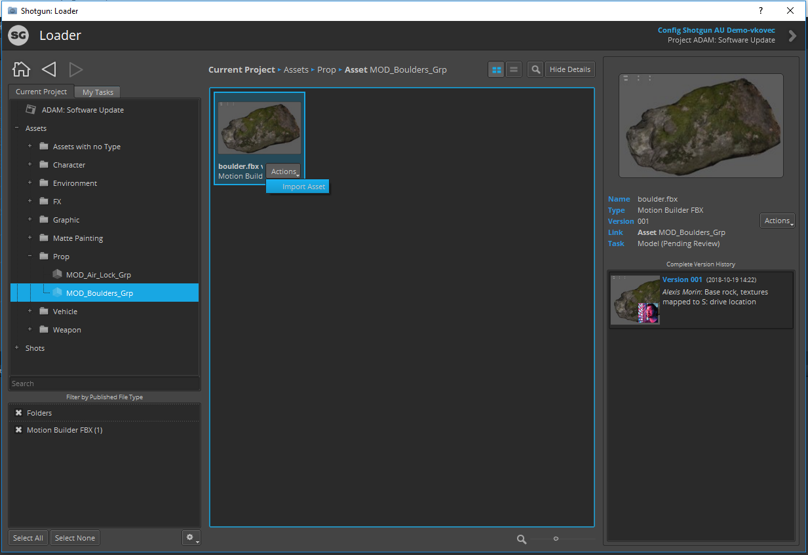

# Loading ShotGrid Content into Unity

Use the [ShotGrid Loader app](https://help.autodesk.com/view/SGSUB/ENU/?guid=SG_Supervisor_Artist_sa_integrations_sa_integrations_user_guide_html#the-loader) to import content published to ShotGrid into your Unity Project:

1. Open the Loader app by selecting ShotGrid > Load.. from the top level Unity menu
2. Browse to the desired asset to load into Unity

3. Load the desired asset(s) by either right-clicking the asset and selecting "Import Asset", selecting Actions > Import Asset, or double clicking on the asset in the browser
4. Select the location under Assets to import the asset into

**Note:** Currently only FBX file import is supported
