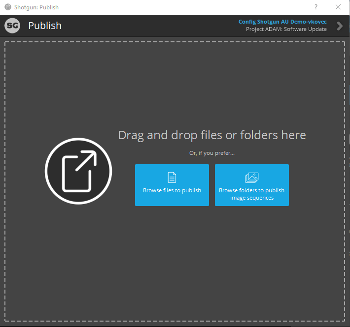

# Publishing Playblasts from Unity to ShotGrid

Use the [Publish app](https://help.autodesk.com/view/SGSUB/ENU/?guid=SG_Supervisor_Artist_sa_integrations_sa_integrations_user_guide_html#the-publisher) included with the ShotGrid Toolkit to upload recorded playblasts as well as other content to ShotGrid.

## Record and Publish with the Unity Recorder

Before starting make sure your scene and Timeline are setup for recording the playblast with the Recorder. Then follow these steps to record a playblast and upload to ShotGrid:

1. Open the Recorder window by selecting Window > General > Recorder > Recorder Window

2. Add a new Movie Recorder. Make sure the Target Frame Rate value matches your Master Timeline settings. To learn more about the concept of Master timeline, see [Establishing the Master Timeline](advancedWorkflows.md#establishing-the-master-timeline).

3. From the Unity menu, select "ShotGrid/Publish Recording...". Unity will start recording, using the movie recorder that is currently selected in the Recorder window. If no movie recorder is selected, Unity will try to find a movie recorder named "ShotGrid". By default, Unity will use the last movie recorder it finds

4. Once the playblast finishes recording, and the editor exits playmode, the ShotGrid Publish window will automatically open, showing the session recording ready to upload

5. Select the "Task", "Link" and optionally add a thumbnail and description, then click "Publish" to publish the playblast to ShotGrid

**Note:** The playblast will be saved to a temporary location on disk

## Publish already recorded Playblasts

In order to publish a previously recorded Playblast, follow these steps:

1. Open the ShotGrid Publish app from the Unity top menu by selecting ShotGrid > Publish...

2. Browse or drag and drop the video file into the publish window

3. Select the "Task", "Link" and optionally add a thumbnail and description, then click "Publish" to publish the playblast to ShotGrid
