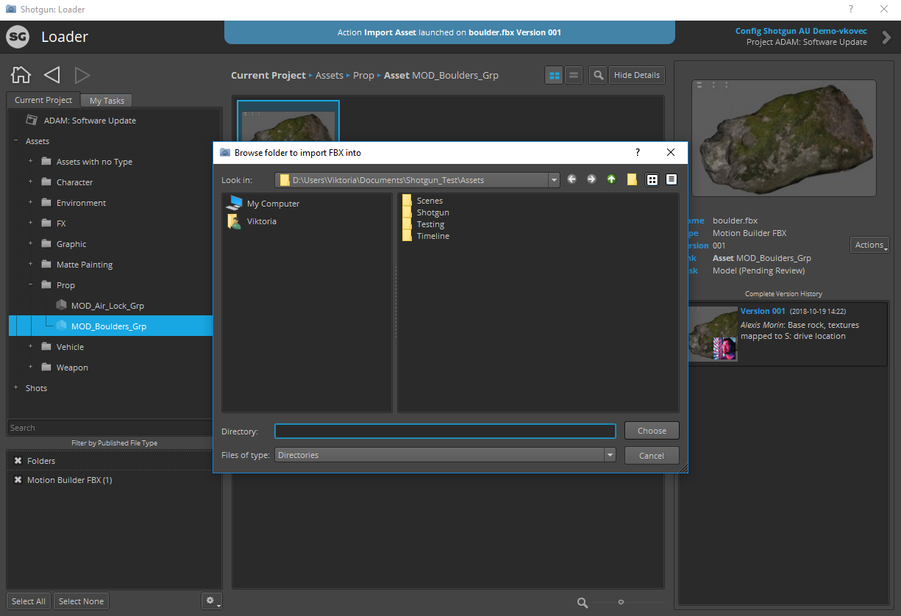

# Loading Shotgrid Content into Unity

Use the [Shotgrid Loader app](https://support.shotgunsoftware.com/hc/en-us/articles/115000068574-Integrations-User-Guide#The%20Loader) to import content published to Shotgrid into your Unity Project:

1. Open the Loader app by selecting Shotgrid > Load.. from the top level Unity menu
2. Browse to the desired asset to load into Unity

3. Load the desired asset(s) by either right-clicking the asset and selecting "Import Asset", selecting Actions > Import Asset, or double clicking on the asset in the browser
4. Select the location under Assets to import the asset into

**Note:** Currently only FBX file import is supported
