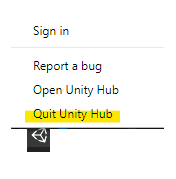

# Troubleshooting
## Reporting Problems
We are actively working on new and existing issues affecting the Shotgun package. 

In case you are blocked, please send the following data to us (in Fogbugz or in
the Forums):
* Your Unity Editor log
* The contents of %APPDATA%/Shotgun/Logs
* The content of the Python console running python.exe (client)

## Unity 2019.1 and More Recent Versions
Starting with Unity 2019.1, launching Unity from Shotgun will bring up the Unity 
Hub (instead of the project selector). 

Version 2.x.y of the Unity Hub will keep running after Unity is launched, and 
will be brought back every time you launch Unity from Shotgun. This is 
problematic if you need to launch Unity from a different Shotgun context, as 
the Unity Hub will retain the first environment variables it was launched with
(the first Shotgun context).

It is important to quit the Unity Hub between launches of Unity. This is a known 
problem and Unity will release a fix for it in an upcoming version of the Unity 
Hub.

**On Windows and CentOS, use the system tray icon:**

**On Mac, use the menu bar:**

