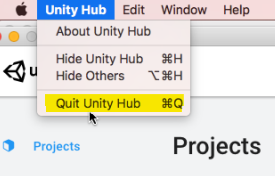

# Troubleshooting
## Reporting Problems
We are actively working on new and existing issues affecting the Shotgun package. 

In case you are blocked, please send the following data to us (in Fogbugz or in
the Forums):
* Your Unity Editor log
* The contents of %APPDATA%/Shotgun/Logs
* The content of the Python console running python.exe (client)

## Problems relating to the Unity Hub
### Always quit the Unity Hub between sessions
Launching Unity from Shotgun will bring up the Unity 
Hub. The Unity Hub will keep running after Unity is launched, and 
will be brought back every time you launch Unity from Shotgun. This is 
problematic if you need to launch Unity from a different Shotgun context, as 
the Unity Hub will retain the first environment variables it was launched with
(the first Shotgun context).

It is important to quit the Unity Hub between launches of Unity. 

**On Windows and CentOS, use the system tray icon:**

**On Mac, use the menu bar:**

### Remove system-defined environment variables
In order to function properly, the Shotgun integration for Unity requires 
certain environment variables to reflect the current Shotgun context. These 
variables are defined when Shotgun Desktop (or the web client) launches Unity 
Hub or the Unity Editor. These environment variable are `PYTHONPATH` and any 
environment variable starting with `SHOTGUN_`. 

Is is important that none of these environment variables are set globally, in 
the system. If these variables are defined globally, the Unity Hub will use the 
global values instead of the ones required for the Shotgun context, resulting
in a non-functioning or misbehaving Shotgun integration in the Unity Editor.

