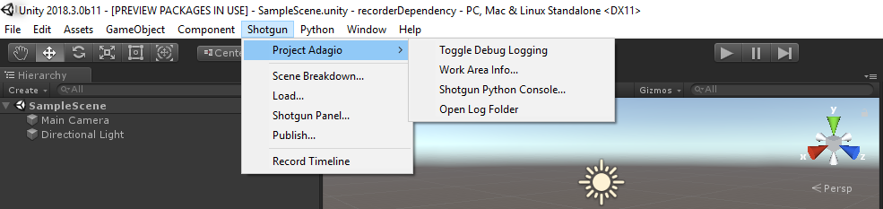

# Shotgrid Menu in Unity

After opening Unity from Shotgrid Desktop, a new top level Shotgrid menu item will appear.

## Top Level Menu Items

| Option    | Description   |
| :-------- | :------------ |
| Scene Breakdown... | Opens the [Scene Breakdown app](https://support.shotgridsoftware.com/hc/en-us/articles/219032988-Scene-Breakdown). |
| Load... | Opens the [Shotgrid Loader app](https://support.shotgridsoftware.com/hc/en-us/articles/115000068574-Integrations-User-Guide#The%20Loader). |
| Shotgrid Panel... | Opens the [Shotgrid Panel](https://support.shotgridsoftware.com/hc/en-us/articles/115000068574#The%20Shotgrid%20Panel), a lightweight version of Shotgrid that allows you to quickly and easily access Shotgrid information such as Notes, Tasks, Versions and Publishes in Unity. | 
| Publish Recording... | Records the timeline and Opens the [Shotgrid Publish app](https://support.shotgridsoftware.com/hc/en-us/articles/115000068574-Integrations-User-Guide#The%20Publisher). |

## Project Specific Menu Items

| Option    | Description   |
| :-------- | :------------ |
| Toggle Debug Logging | If Debug Logging is enabled, the Shotgrid integration will write debug messages to the Unity Console as well as a log file on disk. |
| Work Area Info... | Opens the [Work Area Information app](https://support.shotgridsoftware.com/hc/en-us/articles/219032958-Work-Area-Information) for the current project. It shows information on the current project, environment settings, and running toolkit apps.|
| Shotgrid Python Console... | Opens the [Shotgrid Python Console](https://support.shotgridsoftware.com/hc/en-us/articles/219033108-Python-Console), an interactive Python console that runs inside Unity. |
| Open Log Folder | Opens the folder containing the Shotgrid log files. |

*Note*: Menu Items available will vary depending on your Pipeline Configuration