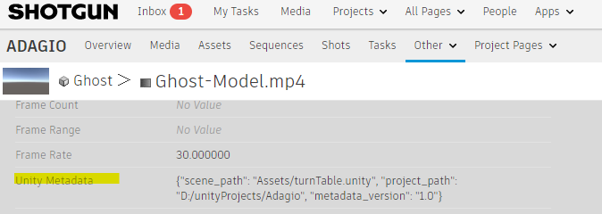
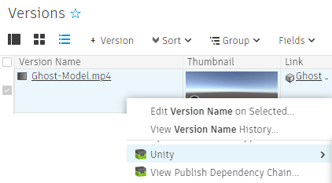
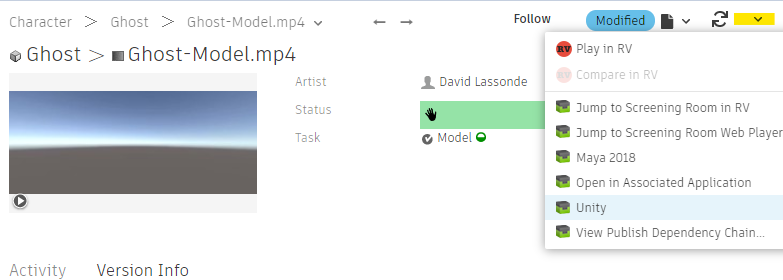
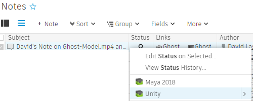
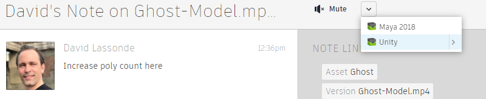
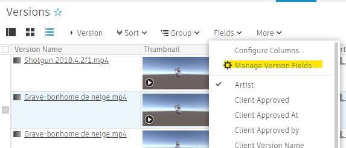
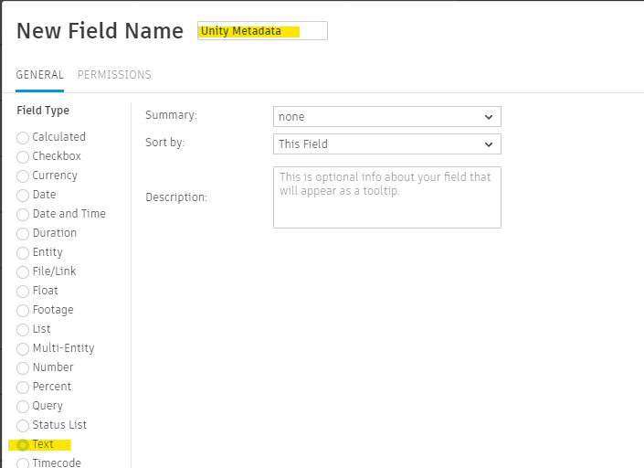
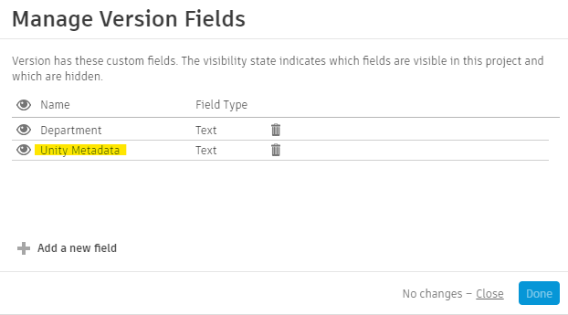
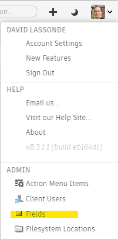
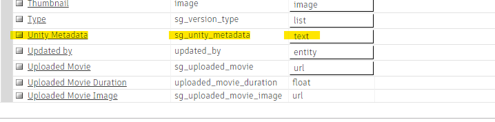

# Advanced Workflows
The tk-config-unity configuration comes with customizations that can greatly
improve artist productivity. 

See [Enabling Advanced Workflows](#enabling-advanced-workflows) for details on how to configure your Shotgun
site to take advantage of these workflows.

## Metadata
When you publish your recordings to Shotgun, Unity embeds the current project path 
and the scene asset path in the created Version entity `sg_unity_metadata` field:

This allows Shotgun to start in the right context (right project, 
right scene) when launched from a Version or Note entity.

### Launching from a Version entity
You can launch Unity from a Version entity in the Versions page:

Or from a Version entity page

### Launching from a Note entity
You can launch Unity from a Note entity in the Notes page:

Or from a Note entity page

In all cases, Unity should launch directly without presenting the Unity Hub or 
the Project Selection dialog.

**Note:** Launching from a Version entity or from a Note entity straight to the 
right Unity project and scene only works if the user has their 
project in the location that is saved in the `sg_unity_metadata` field.
If there is no matching Unity project, then the Unity Hub/Project Selector will
be launched instead.

## Enabling Advanced Workflows
Unity uses a custom Version entity field named `sg_unity_metadata` in order to
save metadata that is used in advanced workflows. Your Shotgun site administrator
needs to add this custom field:

1. As an administrator, go to the Versions page
2. Select `Manage Version Fields...`  

    

3. Create a `text` field, named `Unity Metadata`  

    

    You should see the new field  

    

4. Go into the Fields page  

      

    There should be a new field on Version entities. The field name should be `Unity Metadata`, the field code should be `sg_unity_metadata`, the data type should be `text`  

    