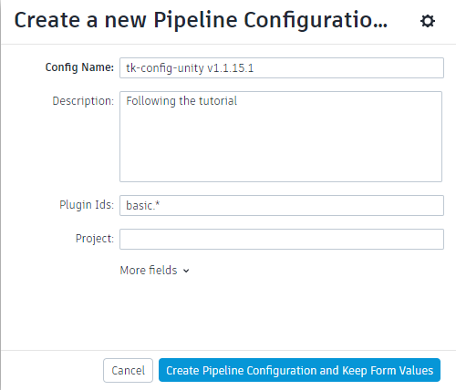
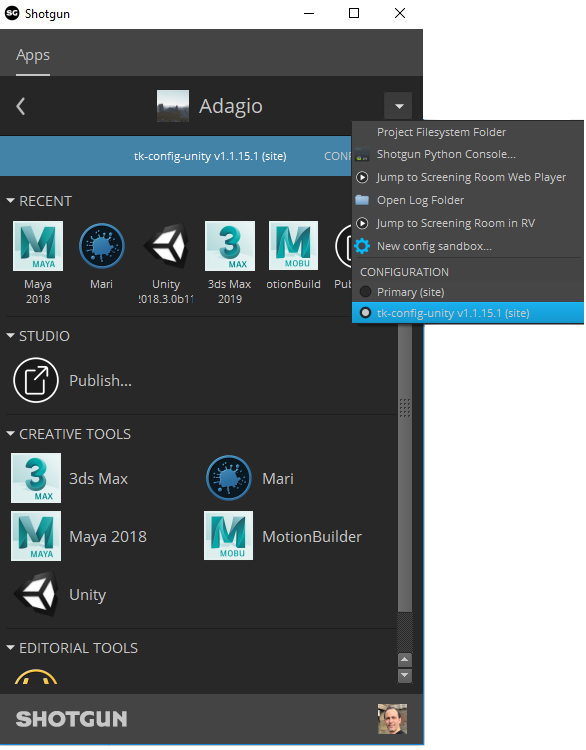

# The Shotgun Configuration

## Baked configuration
The easiest way to get started is to use our latest tk-config-unity pipeline configuration. It is constantly kept up-to-date with the tk-config-default2 configuration. Simply follow these steps in order to use it:

1. Download the baked configuration zip file. It is attached to its corresponding github release. For example, you can download the tk-config-unity configuration version 1.1.15.1 by following [this link](https://github.com/Unity-Technologies/tk-config-unity/releases/download/v1.1.15.1/tk-config-unity-v1.1.15.1.zip).
2. In the Shotgun Web Client, go to “Your Avatar”/Default Layouts/Pipeline Configuration/Pipeline Configuration List
3. Create a new Pipeline Configuration

**Note:** it is important to set the Plugin Ids field to ”basic.*”

4. Upload the config zip file to the new pipeline configuration (choose Upload File and browse to the config you downloaded at step 1)

5. Launch Shotgun Desktop
6. Choose your project
7. In the top section, if there is an arrow, click it and choose your new configuration

8. Once loaded, you should see a Unity icon. Clicking on the arrow at the bottom-right of the Unity icon should display all the versions of Unity that were discovered by Shotgun. 
If you do not see a Unity icon, go to the “Enabling Toolkit and Unity for your Shotgun Project” and resume these steps after.

9. Select a 2018.3 version of Unity. 2018.2 also works but requires changing to .NET framework version 4.x (Edit/Project Settings/Player/Configuration/Api Compatibility Level)

10. Unity should launch
