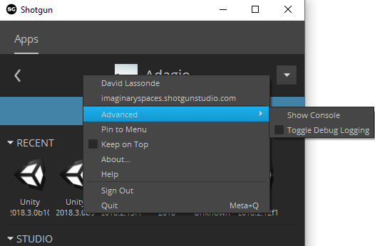

# Preparing a Unity project for Shotgun
You will need to add the Shotgun package to your Unity project's Packages/manifest.json file, like so:
```
{
  "dependencies": {
    "com.unity.integrations.shotgun": "0.4.0-preview",
	[...]
  },
  "registry": "https://staging-packages.unity.com"
}
```

## Compatibility Matrix
Please use the Shotgun package version corresponding to your configuration version

| tk-config-unity version | com.unity.integrations.shotgun version |
| :---------------------- | :------------------------------------- |
| 1.2.5.1                 | 0.4.0-preview                          |
| 1.2.1.1                 | 0.3.0-preview                          |
| 1.1.15.2                | 0.2.0-preview                          |
| 1.1.15.1                | 0.1.0-preview                          |
   
Shotgun should automatically initialize on Unity startup. You should see a 
progress bar reporting the Shotgun toolkit bootstrap progress:


Once the progress bar disappears, you can use the Shotgun menu applications. 

## OSX
It is possible that your system Python (`/usr/bin/python`) is not using a secure
version of TLS (lower than v1.2), which makes it incompatible with Shotgun, as described 
[here](https://support.shotgunsoftware.com/hc/en-us/articles/360009371913-Insecure-HTTPS-and-Old-Toolkit-Core-Deprecation-May-15th-2019).

See the [Troubleshooting](troubleshooting.md#using-a-python-that-is-compatible-with-shotgun) 
section on how to use a Python that is compatible with Shotgun.

## Unity 2019.1 and more recent versions
See the [Troubleshooting](troubleshooting.md#unity-20191-and-more-recent-versions) 
section on how to workaround Shotgun problems caused by the Unity Hub 2.0.

## Notes
A Shotgun folder will be created under your Unity project's 
Assets folder. This Shotgun folder will automatically be deleted when Unity 
exits. Do not use the `Assets/Shotgun` folder to store your files, and do not 
modify its content.

It is recommended to disable Debug Logging in order to get better performance 
(right-click in a 
gray area of Shotgun Desktop / Advanced / Toggle Debug Logging):



