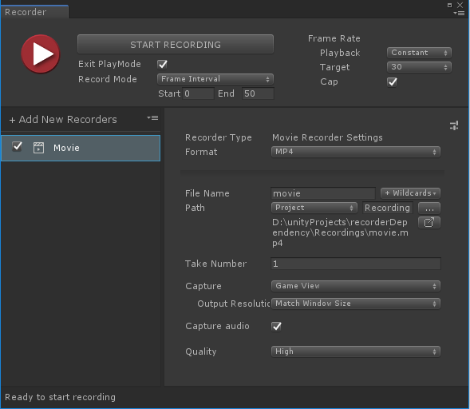
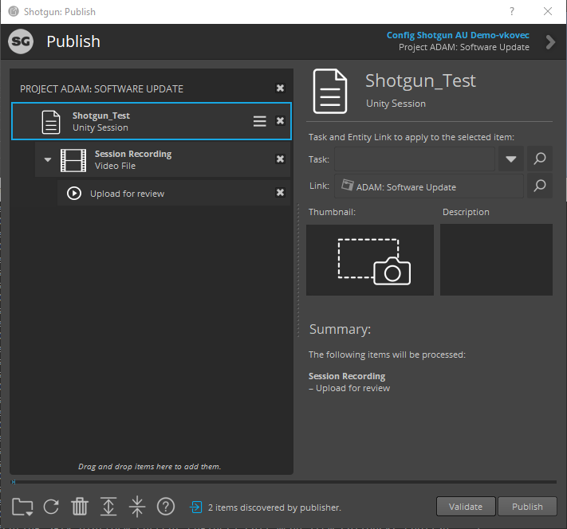

# Publishing Playblasts from Unity to Shotgun

Use the [Publish app](https://support.shotgunsoftware.com/hc/en-us/articles/115000068574-Integrations-User-Guide#The%20Publisher) included with the Shotgun Toolkit to upload recorded playblasts as well as other content to Shotgun.

## Record and Publish with the Unity Recorder

Before starting make sure your scene and Timeline are setup for recording the playblast with the Recorder. Then follow these steps to record a playblast and upload to Shotgun:

1. Open the Recorder window by selecting Window > General > Recorder > Recorder Window

2. Add a new Movie Recorder

3. From the Unity menu, select Shotgun/Record Timeline. Unity will start recording, using the movie recorder that is currently selected in the Recorder window. If no movie recorder is selected, Unity will try to find a movie recorder named "Shotgun". By default, Unity will use the last movie recorder it finds

4. Once the playblast finishes recording, and the editor exits playmode, the Shotgun Publish window will automatically open, showing the session recording ready to upload

5. Select the "Task", "Link" and optionally add a thumbnail and description, then click "Publish" to publish the playblast to Shotgun

**Note:** The playblast will be saved to a temporary location on disk

## Publish already recorded Playblasts

In order to publish a previously recorded Playblast, follow these steps:

1. Open the Shotgun Publish app from the Unity top menu by selecting Shotgun > Publish...

2. Browse or drag and drop the video file into the publish window

3. Select the "Task", "Link" and optionally add a thumbnail and description, then click "Publish" to publish the playblast to Shotgun