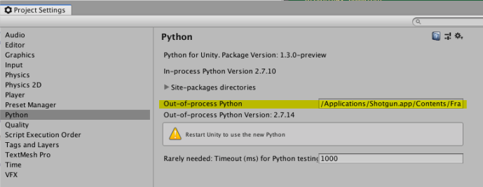
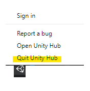
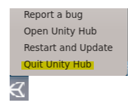
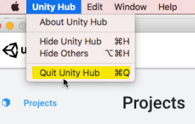

# Troubleshooting
## Reporting Problems
We are actively working on problems with the Shotgun integration and are releasing new configs/engines/Python packages regularly. Sometimes it is still required to quit Unity when Shotgun does not respond anymore. You might also need to kill the client “python.exe” process that is launched when operating Shotgun before starting Unity from Shotgun Desktop again.

In case you are blocked, please send the following data to us (#devs-shotgun):
* Your Unity Editor log
* The contents of %APPDATA%/Shotgun/Logs
* The content of the Python console running python.exe (client)
* * Option 1: paste the content of the console if available
* * Option 2: set UNITY_PYTHON_CLIENT_LOGFILE in the environment prior to launching Shotgun Desktop then send the file contents. E.g.:
```
set UNITY_PYTHON_CLIENT_LOGFILE=d:\temp\mylog.txt
```

## Using a Python That is Compatible With Shotgun
1. It is recommended to set your Out-of-process Python to the one that ships with 
Shotgun Desktop. In order to do so, Open the Python Settings (Edit/Projects Settings/Python):

1. Set the Out-of-process Python to the Shotgun Desktop Python, typically 
`/Applications/Shotgun.app/Contents/Frameworks/Python/bin/python`
1. You might need to kill Unity and the Out-of-process Python from a terminal:
```
killall Unity
killall python
```
1. Killing Python will require you to restart Shotgun Desktop
1. Restart Unity from Shotgun Desktop. Shotgun should bootstrap

Different versions/flavors of Python might work, but could potentially:
* crash the Python client
* report a `ResponseNotReady` Python exception Error stack trace similar to this:

```
Traceback (most recent call last):
  File "/Users/david/Library/Caches/Shotgun/bundle_cache/sg/unity-dev/v1977/tk-unity/plugins/basic/bootstrap.py", line 40, in plugin_startup
    tk_unity_basic.plugin_bootstrap(plugin_root_path)
  File "/Users/david/Library/Caches/Shotgun/bundle_cache/sg/unity-dev/v1977/tk-unity/plugins/basic/tk_unity_basic/plugin_bootstrap.py", line 70, in plugin_bootstrap
    __launch_sgtk(base_config, plugin_id, bundle_cache)
  File "/Users/david/Library/Caches/Shotgun/bundle_cache/sg/unity-dev/v1977/tk-unity/plugins/basic/tk_unity_basic/plugin_bootstrap.py", line 139, in __launch_sgtk
    entity

  [...]

  File "/Users/david/Library/Caches/Shotgun/unity-dev/p86c79.basic.desktop/cfg/install/core/python/tank_vendor/shotgun_api3/lib/httplib2/__init__.py", line 1350, in _request
    (response, content) = self._conn_request(conn, request_uri, method, body, headers)
  File "/Users/david/Library/Caches/Shotgun/unity-dev/p86c79.basic.desktop/cfg/install/core/python/tank_vendor/shotgun_api3/lib/httplib2/__init__.py", line 1306, in _conn_request
    response = conn.getresponse()
  File "/System/Library/Frameworks/Python.framework/Versions/2.7/lib/python2.7/httplib.py", line 1119, in getresponse
    raise ResponseNotReady()
ResponseNotReady
```

## Unity 2019.1 and More Recent Versions
Starting with Unity 2019.1, launching Unity from Shotgun will bring up the Unity 
Hub (instead of the project selector). 

Version 2.0.x of the Unity Hub will keep running after Unity is launched, and 
will be brought back every time you launch Unity from Shotgun. This is 
problematic if you need to launch Unity from a different Shotgun context, as 
the Unity Hub will retain the first environment variables it was launched with
(the first Shotgun context).

It is important to quit the Unity Hub between launches of Unity. This is a known 
problem and Unity will release a fix for it in an upcoming version of the Unity 
Hub.

**On Windows and CentOS, use the system tray icon:**




**On Mac, use the menu bar:**


