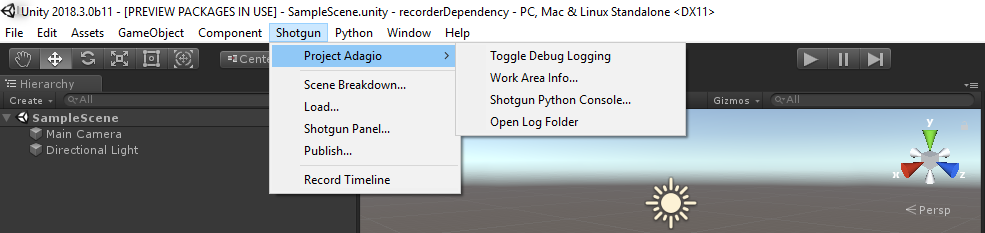

# Shotgun Menu in Unity

After opening Unity from Shotgun Desktop, a new top level Shotgun menu item will appear.

## Top Level Menu Items

| Option    | Description   |
| :-------- | :------------ |
| Scene Breakdown... | Opens the [Scene Breakdown app](https://support.shotgunsoftware.com/hc/en-us/articles/219032988-Scene-Breakdown). |
| Load... | Opens the [Shotgun Loader app](https://support.shotgunsoftware.com/hc/en-us/articles/115000068574-Integrations-User-Guide#The%20Loader). |
| Shotgun Panel... | Opens the [Shotgun Panel](https://support.shotgunsoftware.com/hc/en-us/articles/115000068574#The%20Shotgun%20Panel), a lightweight version of Shotgun that allows you to quickly and easily access Shotgun information such as Notes, Tasks, Versions and Publishes in Unity. | 
| Publish... | Opens the [Shotgun Publish app](https://support.shotgunsoftware.com/hc/en-us/articles/115000068574-Integrations-User-Guide#The%20Publisher). |
| Record Timeline | Records the timeline and Opens the [Shotgun Publish app](https://support.shotgunsoftware.com/hc/en-us/articles/115000068574-Integrations-User-Guide#The%20Publisher). |

## Project Specific Menu Items

| Option    | Description   |
| :-------- | :------------ |
| Toggle Debug Logging | If Debug Logging is enabled, the Shotgun integration will write debug messages to the Unity Console as well as a log file on disk. |
| Work Area Info... | Opens the [Work Area Information app](https://support.shotgunsoftware.com/hc/en-us/articles/219032958-Work-Area-Information) for the current project. It shows information on the current project, environment settings, and running toolkit apps.|
| Shotgun Python Console... | Opens the [Shotgun Python Console](https://support.shotgunsoftware.com/hc/en-us/articles/219033108-Python-Console), an interactive python console that runs inside Unity. |
| Open Log Folder | Opens the folder containing the Shotgun log files. |

*Note*: Menu Items available will vary depending on your Pipeline Configuration